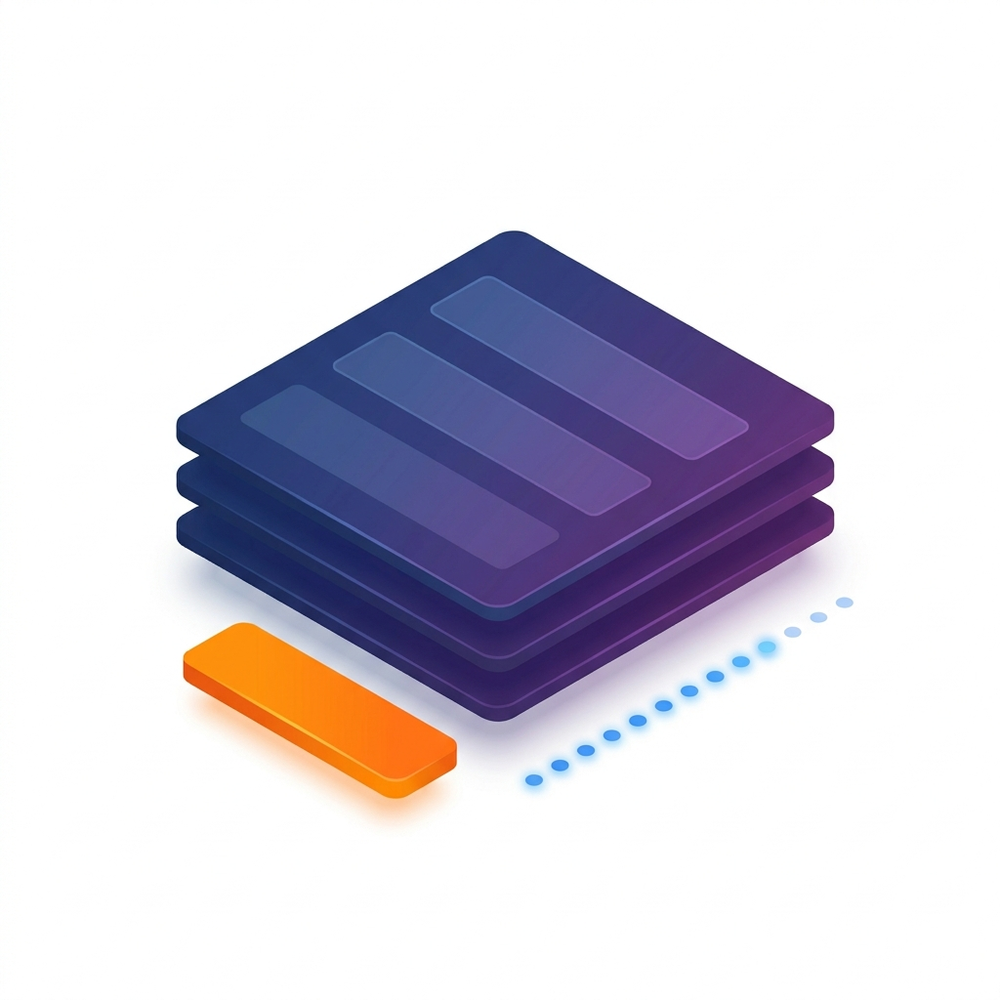
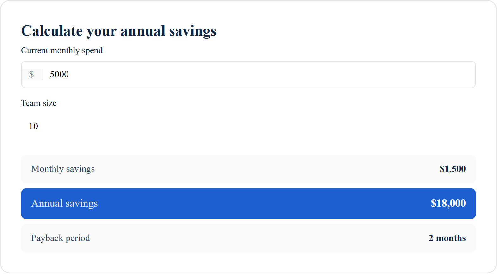

  

# claude-skills-widgets

A research-backed pattern catalog of lead-gen, CTA, social proof, urgency, and interactive tooling patterns used by top-converting B2B SaaS, fintech, DTC, and consumer brands.

Documentation and code. Each pattern includes description, variations, real-world examples with attribution, implementation notes, and brand archetype compatibility. Most patterns also ship a production-ready component.

Companion to [rampstackco/claude-skills](https://github.com/rampstackco/claude-skills) for users building landing pages, marketing surfaces, or product onboarding with Claude.

## Why a pattern catalog and not just a component library

Most component libraries (Tailwind UI, shadcn/ui, Catalyst) ship code. They solve the "how do I implement this" problem.

This catalog solves a different problem first: "which pattern should I use, and why." Then it ships the code too.

Code without pattern understanding produces generic implementations. Pattern documentation without code can be implemented in any stack, framework, or design system. For users building with Claude or other AI tools, the pattern provides the reasoning and the AI handles the code; for everyone else, the component implementations are ready to drop in.

## What's in the catalog

Five pattern categories, ~65 patterns, and 32 component implementations:

- **CTA patterns** (~20): primary buttons, secondary CTAs, sticky bars, exit-intent, in-content, contextual prompts
- **Lead capture patterns** (~15): inline forms, multi-step, content gates, modals, progressive profiling, social login
- **Social proof patterns** (~12): logo strips, testimonials, customer counts, activity feeds, reviews, case studies
- **Urgency patterns** (~8): countdowns, scarcity indicators, deadline framing, real-time activity
- **Interactive tooling patterns** (~10): calculators, quizzes, configurators, wizards, comparison tools

<table>
  <tr>
    <td align="center" width="20%">
      
      
<strong>CTA</strong>

    </td>
    <td align="center" width="20%">
      
      
<strong>Lead Capture</strong>

    </td>
    <td align="center" width="20%">
      
      
<strong>Social Proof</strong>

    </td>
    <td align="center" width="20%">
      
      
<strong>Urgency</strong>

    </td>
    <td align="center" width="20%">
      
      
<strong>Interactive Tooling</strong>

    </td>
  </tr>
</table>

Browse `patterns/{category}/README.md` for the full pattern list per category.

## Featured components

A taste of what is available. Browse the full catalog below.

| Component | Preview | What it does |
|---|---|---|
| **Primary Button CTA** |  | The one-clear-action button pattern. Solid and outlined variants, multiple shapes, optional icon. [Pattern](patterns/cta/01-primary-button-cta.md) &middot; [Component](components/primary-button-cta/) &middot; [Live](https://rampstack.co/showcase/widgets/primary-button-cta) |
| **Trust Logo Strip** |  | Horizontal customer logo strip with grayscale-on-hover styling. [Pattern](patterns/social-proof/01-customer-logo-strip.md) &middot; [Component](components/trust-logo-strip/) &middot; [Live](https://rampstack.co/showcase/widgets/trust-logo-strip) |
| **Single Quote Testimonial** |  | One prominent quote with attribution. Minimal, card, or with-headshot variants. [Pattern](patterns/social-proof/03-single-quote-testimonial.md) &middot; [Component](components/single-quote-testimonial/) &middot; [Live](https://rampstack.co/showcase/widgets/single-quote-testimonial) |
| **Countdown Timer** |  | Real-time countdown to a deadline. Updates every second. [Pattern](patterns/urgency/01-countdown-timer.md) &middot; [Component](components/countdown-timer/) &middot; [Live](https://rampstack.co/showcase/widgets/countdown-timer) |
| **Savings Calculator** |  | Generic config-driven calculator. Define inputs and a compute function via props. [Pattern](patterns/interactive-tooling/02-savings-calculator.md) &middot; [Component](components/savings-calculator/) &middot; [Live](https://rampstack.co/showcase/widgets/savings-calculator) |
| **Hero Stack CTA** |  | Primary button plus an optional secondary action. The standard B2B hero pattern. [Pattern](patterns/cta/06-hero-stack-primary-plus-secondary.md) &middot; [Component](components/hero-stack-cta/) &middot; [Live](https://rampstack.co/showcase/widgets/hero-stack-cta) |

[Browse all 32 components on rampstack.co](https://rampstack.co/showcase/widgets)

## Component implementations (32 components, 6 categories)

Production-ready React and HTML/CSS implementations of the patterns. Each component ships both variants via shared CSS, customizable through CSS custom properties.

### CTA components (6)

- **Primary Button CTA** (v2.1) - [pattern](patterns/cta/01-primary-button-cta.md) &middot; [component](components/primary-button-cta/) &middot; [live](https://rampstack.co/showcase/widgets/primary-button-cta)
- **Secondary Text CTA** (v2.2) - [pattern](patterns/cta/02-secondary-text-cta.md) &middot; [component](components/secondary-text-cta/) &middot; [live](https://rampstack.co/showcase/widgets/secondary-text-cta)
- **Sticky Bar CTA** (v2.2) - [pattern](patterns/cta/03-sticky-bottom-bar-cta.md) &middot; [component](components/sticky-bar-cta/) &middot; [live](https://rampstack.co/showcase/widgets/sticky-bar-cta)
- **Hero Stack CTA** (v2.1) - [pattern](patterns/cta/06-hero-stack-primary-plus-secondary.md) &middot; [component](components/hero-stack-cta/) &middot; [live](https://rampstack.co/showcase/widgets/hero-stack-cta)
- **Footer CTA Section** (v2.3) - [pattern](patterns/cta/09-footer-cta-section.md) &middot; [component](components/footer-cta-section/) &middot; [live](https://rampstack.co/showcase/widgets/footer-cta-section)
- **Multi-Option CTA Cluster** (v2.3) - [pattern](patterns/cta/13-multi-option-cta-cluster.md) &middot; [component](components/multi-option-cta-cluster/) &middot; [live](https://rampstack.co/showcase/widgets/multi-option-cta-cluster)

### Lead Capture components (4)

- **Inline Single Field Form** (v2.1) - [pattern](patterns/lead-capture/01-inline-single-field-form.md) &middot; [component](components/inline-single-field-form/) &middot; [live](https://rampstack.co/showcase/widgets/inline-single-field-form)
- **Inline Multi Field Form** (v2.2) - [pattern](patterns/lead-capture/02-inline-multi-field-form.md) &middot; [component](components/inline-multi-field-form/) &middot; [live](https://rampstack.co/showcase/widgets/inline-multi-field-form)
- **Newsletter Signup Inline** (v2.2) - [pattern](patterns/lead-capture/08-newsletter-signup-inline.md) &middot; [component](components/newsletter-signup-inline/) &middot; [live](https://rampstack.co/showcase/widgets/newsletter-signup-inline)
- **Social Login Buttons** (v2.3) - [pattern](patterns/lead-capture/11-social-login-buttons.md) &middot; [component](components/social-login-buttons/) &middot; [live](https://rampstack.co/showcase/widgets/social-login-buttons)

### Social Proof components (6)

- **Trust Logo Strip** (v2.0) - [pattern](patterns/social-proof/01-customer-logo-strip.md) &middot; [component](components/trust-logo-strip/) &middot; [live](https://rampstack.co/showcase/widgets/trust-logo-strip)
- **Featured In Press Strip** (v2.6) - [pattern](patterns/social-proof/02-featured-in-press-strip.md) &middot; [component](components/featured-in-press-strip/) &middot; [live](https://rampstack.co/showcase/widgets/featured-in-press-strip)
- **Single Quote Testimonial** (v2.1) - [pattern](patterns/social-proof/03-single-quote-testimonial.md) &middot; [component](components/single-quote-testimonial/) &middot; [live](https://rampstack.co/showcase/widgets/single-quote-testimonial)
- **Testimonial Grid** (v2.2) - [pattern](patterns/social-proof/05-testimonial-grid.md) &middot; [component](components/testimonial-grid/) &middot; [live](https://rampstack.co/showcase/widgets/testimonial-grid)
- **Customer Count** (v2.1) - [pattern](patterns/social-proof/07-customer-count-display.md) &middot; [component](components/customer-count/) &middot; [live](https://rampstack.co/showcase/widgets/customer-count)
- **Review Aggregate** (v2.2) - [pattern](patterns/social-proof/09-review-aggregate.md) &middot; [component](components/review-aggregate/) &middot; [live](https://rampstack.co/showcase/widgets/review-aggregate)

### Urgency components (3)

- **Countdown Timer** (v2.1) - [pattern](patterns/urgency/01-countdown-timer.md) &middot; [component](components/countdown-timer/) &middot; [live](https://rampstack.co/showcase/widgets/countdown-timer)
- **Limited Time Offer Banner** (v2.3) - [pattern](patterns/urgency/04-limited-time-offer-banner.md) &middot; [component](components/limited-time-offer-banner/) &middot; [live](https://rampstack.co/showcase/widgets/limited-time-offer-banner)
- **Waitlist Position Display** (v2.3) - [pattern](patterns/urgency/06-waitlist-position-display.md) &middot; [component](components/waitlist-position-display/) &middot; [live](https://rampstack.co/showcase/widgets/waitlist-position-display)

### Interactive Tooling components (9)

- **Savings Calculator** (v2.3), covers both the savings calculator and ROI cost calculator patterns - [pattern](patterns/interactive-tooling/02-savings-calculator.md) &middot; [component](components/savings-calculator/) &middot; [live](https://rampstack.co/showcase/widgets/savings-calculator)
- **Diagnostic Quiz Assessment** (v2.4) - [pattern](patterns/interactive-tooling/04-diagnostic-quiz-assessment.md) &middot; [component](components/diagnostic-quiz-assessment/) &middot; [live](https://rampstack.co/showcase/widgets/diagnostic-quiz-assessment)
- **Product-Market Fit Quiz** (v2.4) - [pattern](patterns/interactive-tooling/03-product-market-fit-quiz.md) &middot; [component](components/product-market-fit-quiz/) &middot; [live](https://rampstack.co/showcase/widgets/product-market-fit-quiz)
- **Multi-Step Recommendation Wizard** (v2.4) - [pattern](patterns/interactive-tooling/05-multi-step-recommendation-wizard.md) &middot; [component](components/multi-step-recommendation-wizard/) &middot; [live](https://rampstack.co/showcase/widgets/multi-step-recommendation-wizard)
- **Pricing Tier Configurator** (v2.5) - [pattern](patterns/interactive-tooling/06-pricing-tier-configurator.md) &middot; [component](components/pricing-tier-configurator/) &middot; [live](https://rampstack.co/showcase/widgets/pricing-tier-configurator)
- **Product Feature Configurator** (v2.5) - [pattern](patterns/interactive-tooling/07-product-feature-configurator.md) &middot; [component](components/product-feature-configurator/) &middot; [live](https://rampstack.co/showcase/widgets/product-feature-configurator)
- **Comparison Tool vs Competitors** (v2.5) - [pattern](patterns/interactive-tooling/08-comparison-tool-vs-competitors.md) &middot; [component](components/comparison-tool-vs-competitors/) &middot; [live](https://rampstack.co/showcase/widgets/comparison-tool-vs-competitors)
- **Scheduling Tool** (v2.6) - [pattern](patterns/interactive-tooling/10-scheduling-tool.md) &middot; [component](components/scheduling-tool/) &middot; [live](https://rampstack.co/showcase/widgets/scheduling-tool)
- **Interactive Product Tour** (v2.6) - [pattern](patterns/interactive-tooling/09-interactive-product-tour.md) &middot; [component](components/interactive-product-tour/) &middot; [live](https://rampstack.co/showcase/widgets/interactive-product-tour)

### Utility components (4)

Utility components ship code without dedicated pattern documentation. They originated in the Threshold reference build and are reusable as generic illustrations or layout helpers.

- **Hero Product Mockup** (v2.0) - [component](components/hero-product-mockup/) &middot; [live](https://rampstack.co/showcase/widgets/hero-product-mockup)
- **Activation Funnel Inline** (v2.0) - [component](components/activation-funnel-inline/) &middot; [live](https://rampstack.co/showcase/widgets/activation-funnel-inline)
- **Time to Value Sparkline** (v2.0) - [component](components/time-to-value-sparkline/) &middot; [live](https://rampstack.co/showcase/widgets/time-to-value-sparkline)
- **Flow Connector** (v2.0) - [component](components/flow-connector/) &middot; [live](https://rampstack.co/showcase/widgets/flow-connector)

## How patterns are documented

Every pattern follows a consistent schema (see `patterns/SCHEMA.md`):

- What it is and why it works
- When to use and when to avoid
- Variations within the family
- 3-7 real-world examples with attribution
- Implementation and accessibility notes
- Which brand archetypes it pairs with

Patterns reference [`claude-skills/skills/brand-archetype-system`](https://github.com/rampstackco/claude-skills/tree/main/skills/brand-archetype-system) for archetype compatibility. A Bold Confident brand uses different CTA patterns than an Editorial Restrained brand; the documentation captures these fit relationships.

## Using the catalog

For people working with Claude or other AI tools: paste the relevant pattern file into context, then ask the AI to implement using your stack. The pattern provides the reasoning; the AI handles the code.

For people building by hand: each pattern is a complete reference for that pattern family. Read the description, pick a variation, follow the implementation notes, or drop in the matching component.

For agencies and consultants: the catalog is a shared vocabulary for client conversations. Pointing at a documented pattern is faster than describing one.

## Companion repos

This repo provides two surfaces: pattern documentation in `patterns/` and component implementations in `components/`. The documentation explains the design space; the components are portable React and HTML/CSS code.

- [rampstackco/claude-skills](https://github.com/rampstackco/claude-skills): the parent catalog of methodology skills covering brand, design, engineering, audit, and growth work (99 skills)
- `rampstackco/claude-skills-starter` (planned): curated 12-15 skill subset for users who want a focused starter pack rather than the full catalog

## Version history

A condensed changelog. See the PR history for full detail.

- **v2.6**: specialized tooling (scheduling, product tour) and the press-strip variant
- **v2.5**: configurators (pricing tier, product feature, comparison)
- **v2.4**: quiz and wizard family (diagnostic, PMF, recommendation wizard)
- **v2.3**: opens interactive-tooling (savings calculator), plus CTA and urgency expansion
- **v2.2**: CTA, lead-capture, and social-proof expansion
- **v2.1**: foundational pattern-mapped components
- **v2.0**: Threshold seed migration (5 components)
- **v1.x**: pattern documentation only (no component implementations)

## Contributing

See CONTRIBUTING.md. Pattern submissions welcome with real-world attribution.

## License

MIT. See LICENSE.
